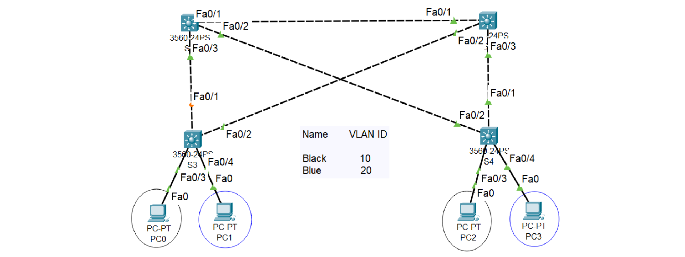

    

<h2 align="center">MY-CCNA 200-301 Preparation</h2>

- #### Cisco Packet Tracer
- #### Version: 8.0.1.0064

## About this project

I passed my **CCNA 200-301** on **17th March 2025**.

During my preparation, I built several labs on various networking topics using **Cisco Packet Tracer**. These labs helped me understand core networking concepts, and I hope they will help you too in your CCNA journey.

## Networking Labs

### [LAB 1: VLAN Configuration](./labs/lab1.pkt)

    

- Two VLANs: **Black & Blue**
- **S3 & S4** connected with Trunk Links
- **PC0 - PC2** & **PC1 - PC3** communicate across switches

### [LAB 2: Static Routing & ROAS](./labs/lab2.pkt)

    

- Static Routes set up between **Router1 & Router0**
- **ROAS (Router on a Stick)** implemented for VLAN 10 & VLAN 20 communication

### [LAB 3: RIP Routing](./labs/lab3.pkt)

    

- **Router 0,1,2,3** connected using **RIP (Routing Information Protocol)**
- Networks **172.18.1.0, 10.2.1.0, 192.168.10.0** communicate via RIP

### [LAB 4: IPv6 Static & Floating Routes](./labs/lab4.pkt)

    

- **IPv6** Address Range: **2001:0db8:0:0::/64**
- Static Routes via **Router 15's G0/1/0** interface
- Floating Route added via **Router 15's G0/0**

### [LAB 5: OSPF Routing](./labs/lab5.pkt)

    

- **OSPF** implemented among five routers
- Router IDs: **1.1.1.1, 2.2.2.2, 3.3.3.3, 4.4.4.4, 5.5.5.5**

### [LAB 6: HSRP (Hot Standby Router Protocol)](./labs/lab6.pkt)

    

- **Router0 & Router1** setup with **HSRP**
- Virtual Router IP: **10.1.1.4/24**
- **Router1 (Active)**, **Router0 (Standby)**

### [LAB 7: TACACS+ Implementation](./labs/lab7.pkt)

    

- Router as **TACACS Client**
- **Server provides authentication services**

### [LAB 8: Wireless LAN - WPA2 PSK](./labs/lab8.pkt)

    

- **AP0, AP1, AP2** connected to **Backbone Network (Switch 0)**
- Each AP runs on **different channels** to avoid overlapping
- Different **Security Settings** configured per AP

### [LAB 9: Access Control Lists (ACLs)](./labs/lab9.pkt)

    

- **Extended ACLs** deployed to control traffic

### [LAB 10: GRE Tunnel](./labs/lab10.pkt)

    

- **GRE Tunnel0** established between **Router0 and Router1**

## About Me

- **Name:** Koushik Roy
- **Twitter:** [@koushikroyfx](https://x.com/koushikroyfx)
- **LinkedIn:** [Koushik Roy](https://www.linkedin.com/in/koushikroy99/)
- **GitHub:** [KoushikRoy](https://github.com/koushikroy99)
- **Portfolio:** [www.koushikroy.in](https://www.koushikroy.in)
- **Email:** koushikroy05042001@gmail.com

    <b><a href="#">↥ Back To Top</a></b>

